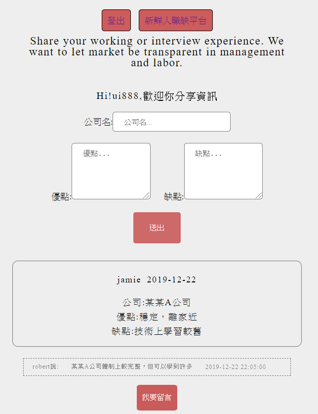

## 求職天眼通留言系統   
[求職天眼通留言系統](https://jamie-php.herokuapp.com/jobs_truth/index.php)  
---
### (A)程式學習到的事情：
* (1) 更加熟悉 PHP 後端簡易 CRUD
  * 熟悉 PHP 語言特性
  * 利用 PHP 與 HTML / CSS 做簡易畫面編排
  * 新增資料、更新資料、刪除資料、讀取資料結合後端資料庫
* (2) 簡易會員系統判斷
  * 解決方法為利用 setcookie 將資料儲存於 browsers
  * 再利用 if (isset($_COOKIE['username']) && !empty($_COOKIE['username'])) 判斷是否登入
  * 並設定只有發文者或是留言發言人才能修改自己言論
* (3) 結合 Javascript DOM 與 PHP 作非同步傳輸資料 
  * 熟悉 XMLHttpRequest 與 PHP 傳輸與接收資料方式 
  * 接收資料後使用 JS 作前端顯示
* (4) 了解資安 SQL Injection 意義
  * 使用 PostgreSQL 查資料了解到 PDO (PHP Database Object) 發現其可加強資訊安全
  * 使用 PDO 防止 SQL Injection ，避免使用者惡意操作資料庫

### (B)程式描述：
上一次寫了求職平台後，想試試看寫一個友善版的天眼通，讓其感覺有一整個系列的感覺。

[PHP簡易天眼通實作心得記錄](https://www.youtube.com/watch?v=wIeKVHRgZZo)

  

解題想法與概念：
1. 前端介面刻劃並思考網頁有哪些頁面
2. 利用 PostgreSQL 資料庫搭配 PHP PDO 方式阻止 SLQ Injection 發生
3. 會員系統利用 setcookie 方式設定，再去寫邏輯去判斷是否登入