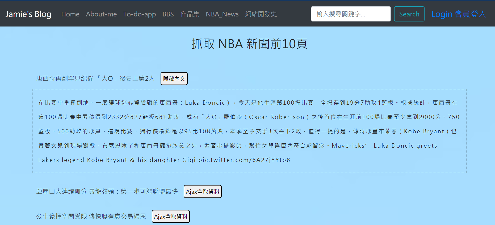

## 在 Django 上爬蟲所有 NBA News 並爬蟲 NBA News  
[NBA_News 連結](https://jamie-web-heroku.herokuapp.com/nba_news) 
---
### (A)程式學習到的事情：
* (1) 重新複習 Django MTV 概念
  1. 開啟虛擬環境 myenv\scripts\activate
  2. 創建專案 python manage.py startapp nba_news
  3. 在大專案資料下 settings.py 註冊此應用項目 & urls.py include 進來，作中央路由設定
  4. 於應用項目內定義路由 urls.py 
  5. 定義 views.py 前，對資料庫欄位 schema 作設計 models.py & 後臺註冊設定 admin.py 作此 class 註冊 
  6. 在 views.py 作操作爬蟲
  7. templates 作顯示
* (2) 練習 Python 與 Javascript 傳送接收資料
  * 利用 Ajax 不換頁提取該超連結網頁內容

### (B)程式描述：
再次熟悉一次 Python Django Framework 與 Javascript 連結，並爬取帥氣的 NBA_News 資料。
[Django 爬蟲影片紀錄與講解](https://www.youtube.com/watch?v=8CC0wVuNfu4)

  

解題想法與概念：
1. 創建 Django App 
2. 主目錄設定應用與路由
3. 應用設定路由與Class
4. 利用 JS 拿取資訊，並利用 Ajax 向 Python 後端要資料
5. 作前端頁面顯示