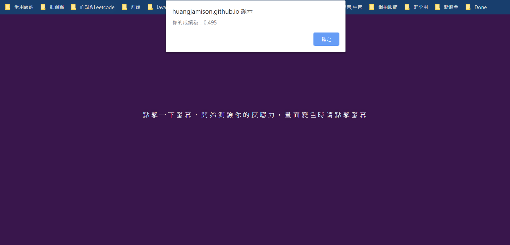

## 用Javascript寫一個反應力遊戲   
[反應力遊戲連結](https://huangjamison.github.io/front-end-portfolio/reaction_game/reaction.html) 
---
### (A)程式學習到的事情：
* (1) 練習刻畫遊戲介面
  * 將遊戲介面分割成五個畫面
  1. click 畫面未變色
  2. 畫面變色 & 計時開始
  3. click 有兩個支線
  4. 畫面變色，使用者點擊，未完成遊戲，跳出太急了
  5. 畫面未變色，使用者點擊，完成遊戲，停止計時
  6. 顯示榜單 & 按鈕
  7. 點選按鈕回到步驟1 
* (2) 了解 Callback 意義與 var & let 差別
  * 在作反應力遊戲時，對於回呼函式不熟悉，加強此方面概念
  * 並了解 let 與 var 的作用域範圍 
* (3) 了解 e.stopImmediatePropagation()
  * 理解事件冒泡機制，先捕獲後冒泡   

### (B)程式描述：
利用反應力遊戲操作，了解如何刻畫遊戲畫面與背後函式如何撰寫，才能達到計算反應時間與再玩一次等功能

[反應力遊戲實作心得記錄](https://reurl.cc/vnXdZl)

  

解題想法與概念：
1. 先試圖想像有幾個遊戲畫面，以及會用到哪些按鈕與事件等
2. Click 事件後 Callback 要執行程式內容撰寫
3. 利用情境去表達不同使用者操作情況
4. 使用者反應力成績利用 splice & IndexOf 去 排序
5. 因冒泡機制會由下到上，因此需更理解冒泡