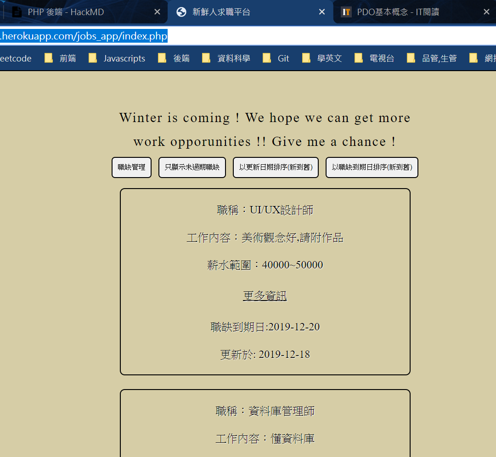

## 用PHP寫一個簡易求職平台結合JS   
[新鮮人求職平台連結](https://jamie-php.herokuapp.com/jobs_app/index.php) [Portfolio_Code頁面](https://huangjamison.github.io/Portfolio_Code/)
---
### (A)程式學習到的事情：
* (1) PHP 後端簡易 CRUD
  * 熟悉 PHP 語言特性
  * 利用 PHP 與 HTML / CSS 做簡易畫面編排
  * 新增資料、更新資料、刪除資料、讀取資料結合後端資料庫
* (2) 練習使用不同資料庫
  * 原先在 Local 端是使用 phpMyAdmin 與 SQL 語法去做 CRUD
  * 後續部署至 Heroku 更熟悉 PostgreSQL 操作
* (3) 結合 Javascript DOM 與 PHP 作非同步傳輸資料 
  * 熟悉 XMLHttpRequest 與 PHP 傳輸與接收資料方式 
  * 接收資料後使用 JS 作前端顯示
* (4) 了解資安 SQL Injection 意義
  * 使用 PostgreSQL 查資料了解到 PDO (PHP Database Object) 發現其可加強資訊安全
  * 使用 PDO 防止 SQL Injection ，避免使用者惡意操作資料庫

### (B)程式描述：
在待業期間，想寫一個簡易求職平台作PHP學習的展現，目標為要作出簡易 CRUD 並結合Javascript非同步方式，將所學串連。

[PHP結合JS&Ajax非同步簡易講解](https://www.youtube.com/watch?v=re8XqEhlviw)

[PHP簡易求職平台實作心得記錄](https://reurl.cc/RdgK4D)

  

解題想法與概念：
1. 前端介面刻劃並思考網頁有哪些頁面
2. 利用 MySQL 去查詢資料、新建資料顯示於前端
3. 練習使用 Javascript 非同步提取資料，並使用 PHP 向資料庫要資料
4. 部署至 Heroku 後，使用並更熟悉 PostgreSQL 資料庫
5. 了解 SLQ Injection 概念，並使用 PDO 概念去預防