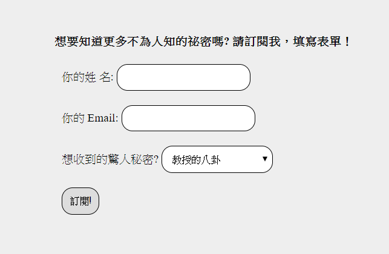

## 利用 Node.js 實作發信功能
   
[發信功能連結](https://nodejs-jamie.herokuapp.com/form)
---
### (A)程式學習到的事情：
* (1) 使用 nodemailer 實作寄信功能
  * 當使用者資料沒填有偵錯機制
  * 熟悉 transporter & mailOptions 內容 

* (2) 了解資安重要性
  * 認識 csurf 與崁入方式等等
  * 帳號密碼運用 dotenv 套件使用環境變數代入

### (B)程式描述：
先前逛電商網站時，發現有最新消息通知我，想了解其是如何做到的，因此就實作一個訂閱服務(寄信)的應用。

[Node.js發信功能實作心得記錄](https://reurl.cc/W4WvNk)

  

解題想法與概念：
1. 上網搜尋相關資源，並理解 nodemailer 套件使用方法
2. 於後端 form.js 定義傳送方式(transporter) & 傳送內容(mailOptions) 
3. 並加入簡單偵錯驗證使用者輸入內容
4. 加強資安觀念並應用於此小作品上